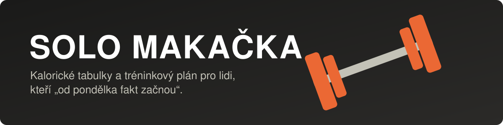
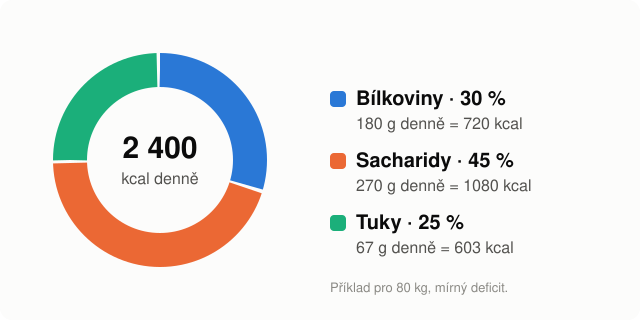
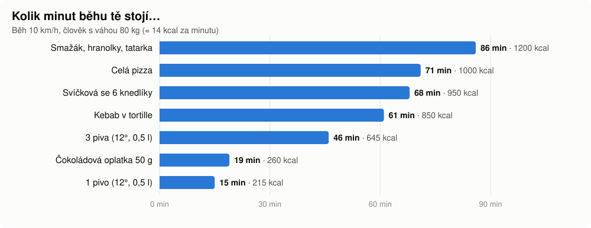
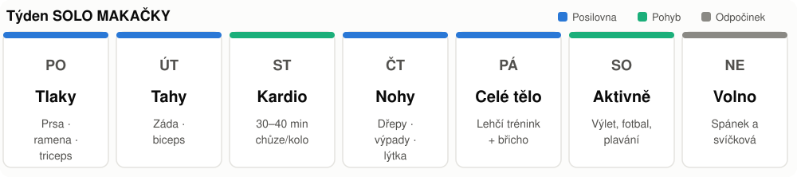

<p align="center">
  
</p>

<p align="center">
  <b>Oficiální příručka Solo Makačky.</b><br>
  Žádné drahé trenéry, žádné zázračné prášky. Jen tabulky, plán a tvoje (zatím) pevná vůle.
</p>

<p align="center">
  🍗 kalorie · 🏋️ trénink · 😴 spánek · 🍺 výčitky
</p>

---

## 📚 Obsah

1. [Kolik toho vlastně sníst](#kolik-jist)
2. [Makra – z čeho ty kalorie mají být](#makra)
3. [Kalorické tabulky](#tabulky)
4. [Zakázané ovoce a kolik tě bude stát](#zakazane-ovoce)
5. [Ukázkový den na talíři](#ukazkovy-den)
6. [Tréninkový plán](#trenink)
7. [Svatá pravidla Solo Makačky](#pravidla)
8. [Progres checklist](#checklist)

---

<a id="kolik-jist"></a>

## 🔥 1. Kolik toho vlastně sníst

Nejdřív spočítej, kolik kalorií spálíš za den (tzv. **TDEE**). Použij vzorec **Mifflin–St Jeor**:

```text
BMR (muži)  = 10 × váha [kg] + 6,25 × výška [cm] − 5 × věk + 5
BMR (ženy)  = 10 × váha [kg] + 6,25 × výška [cm] − 5 × věk − 161

TDEE = BMR × koeficient aktivity
```

| Aktivita | Koeficient |
|---|:---:|
| Gauč, Netflix, chipsy | 1,2 |
| Trénink 1–3× týdně | 1,375 |
| **Trénink 3–5× týdně (Solo Makačka)** | **1,55** |
| Trénink denně + fyzická práce | 1,725 |

**Příklad:** 80 kg, 180 cm, 20 let, trénink 4× týdně

```text
BMR  = 800 + 1125 − 100 + 5 = 1 830 kcal
TDEE = 1 830 × 1,55          ≈ 2 840 kcal
```

| Cíl | Kolik jíst | Pro náš příklad |
|---|---|:---:|
| 🔻 Hubnutí (rýsování) | TDEE − 300 až 500 kcal | **≈ 2 400 kcal** |
| ⚖️ Udržování | TDEE | **≈ 2 840 kcal** |
| 🔺 Nabírání (bulk) | TDEE + 200 až 300 kcal | **≈ 3 100 kcal** |

> 💡 **Bílkoviny:** 1,6–2,2 g na kilo váhy. Pro 80 kg je to zhruba **130–175 g denně**.

---

<a id="makra"></a>

## 🥧 2. Makra – z čeho ty kalorie mají být

<p align="center">
  
</p>

| Živina | Kolik kcal má 1 g | K čemu je |
|---|:---:|---|
| 🍗 Bílkoviny | 4 kcal | Stavba svalů, dlouho zasytí |
| 🍚 Sacharidy | 4 kcal | Palivo na trénink |
| 🥑 Tuky | 9 kcal | Hormony, vitamíny, chuť do života |
| 🍺 Alkohol | 7 kcal | Absolutně k ničemu, ale chutná |

---

<a id="tabulky"></a>

## 📊 3. Kalorické tabulky

Všechny hodnoty jsou **na 100 g** a orientační. Přesná čísla najdeš na obalu.

### 🍗 Bílkoviny

| Potravina | kcal | Bílkoviny | Sacharidy | Tuky |
|---|---:|---:|---:|---:|
| Kuřecí prsa (vařená/grilovaná) | 165 | 31 g | 0 g | 3,6 g |
| Losos | 208 | 20 g | 0 g | 13 g |
| Vejce (cca 2 ks) | 143 | 12,6 g | 0,7 g | 9,5 g |
| Tvaroh polotučný | 120 | 12 g | 4 g | 6 g |
| Řecký jogurt 0 % | 59 | 10 g | 3,6 g | 0,4 g |

### 🍚 Sacharidy

| Potravina | kcal | Bílkoviny | Sacharidy | Tuky |
|---|---:|---:|---:|---:|
| Ovesné vločky | 372 | 13 g | 59 g | 7 g |
| Rýže (vařená) | 130 | 2,7 g | 28 g | 0,3 g |
| Brambory (vařené) | 87 | 1,9 g | 20 g | 0,1 g |
| Celozrnný chléb | 247 | 13 g | 41 g | 3,4 g |
| Banán | 89 | 1,1 g | 23 g | 0,3 g |

### 🥦 Zelenina a tuky

| Potravina | kcal | Bílkoviny | Sacharidy | Tuky |
|---|---:|---:|---:|---:|
| Brokolice | 34 | 2,8 g | 7 g | 0,4 g |
| Arašídové máslo | 588 | 25 g | 20 g | 50 g |
| Olivový olej | 884 | 0 g | 0 g | 100 g |

> ⚠️ **Olivový olej** je zdravý, ale lžíce navíc má 120 kcal. Odměřuj ho, nelij ho z flašky.

---

<a id="zakazane-ovoce"></a>

## 🍕 4. Zakázané ovoce a kolik tě bude stát

Nic není zakázané. Jen to něco stojí. Tady je ceník v **minutách běhu**:

<p align="center">
  
</p>

| Hřích | kcal | Minut běhu (10 km/h) |
|---|---:|---:|
| 🧀 Smažák, hranolky, tatarka | ~1 200 | **86** |
| 🍕 Celá pizza | ~1 000 | **71** |
| 🥩 Svíčková se 6 knedlíky | ~950 | **68** |
| 🌯 Kebab v tortille | ~850 | **61** |
| 🍺🍺🍺 3 piva (12°, 0,5 l) | ~645 | **46** |
| 🍫 Čokoládová oplatka 50 g | ~260 | **19** |
| 🍺 „Jen jedno“ pivo | ~215 | **15** |

> 🧮 Rychlý přepočet: 1 kilo tuku ≈ 7 700 kcal ≈ **6 a půl smažáku** ≈ **36 piv** ≈ **9 hodin běhu**. Volba je tvoje.

---

<a id="ukazkovy-den"></a>

## 🍽️ 5. Ukázkový den na talíři

Cíl: **≈ 2 450 kcal** a **≈ 190 g bílkovin**.

| Jídlo | Co sníst | kcal | Bílkoviny |
|---|---|---:|---:|
| 🌅 Snídaně | 80 g ovesných vloček, banán, 150 g řeckého jogurtu | 494 | 27 g |
| 🍎 Svačina | 200 g tvarohu, lžíce arašídového másla (20 g) | 358 | 29 g |
| 🍛 Oběd | 200 g kuřecích prsou, 200 g rýže, 200 g brokolice | 658 | 73 g |
| 🥪 Svačina | 2 plátky celozrnného chleba, 2 vejce | 370 | 25 g |
| 🐟 Večeře | 150 g lososa, 250 g brambor, zeleninový salát | 580 | 37 g |
| **Celkem** | | **≈ 2 460** | **≈ 190 g** |

---

<a id="trenink"></a>

## 🏋️ 6. Tréninkový plán

<p align="center">
  
</p>

**Jak číst tabulky:** `4 × 6–8` znamená 4 série po 6 až 8 opakováních. Mezi sériemi odpočívej 1,5–3 minuty u těžkých cviků a 60–90 sekund u ostatních.

<details>
<summary><b>🔵 PONDĚLÍ – Tlaky (prsa, ramena, triceps)</b></summary>

| Cvik | Série × opakování |
|---|:---:|
| Bench press | 4 × 6–8 |
| Tlaky s jednoručkami na šikmé lavici | 3 × 8–10 |
| Tlaky nad hlavu (vestoje) | 3 × 8–10 |
| Upažování s jednoručkami | 3 × 12–15 |
| Kliky na bradlech | 3 × max |
| Triceps na kladce | 3 × 12 |

</details>

<details>
<summary><b>🔵 ÚTERÝ – Tahy (záda, biceps)</b></summary>

| Cvik | Série × opakování |
|---|:---:|
| Shyby (nebo stahování kladky) | 4 × 6–10 |
| Přítahy velké činky v předklonu | 4 × 8 |
| Přítahy jednoručky jednoruč | 3 × 10 na ruku |
| Face pull | 3 × 15 |
| Bicepsový zdvih s činkou | 3 × 10–12 |
| Kladiva | 3 × 12 |

</details>

<details>
<summary><b>🟢 STŘEDA – Kardio</b></summary>

30–40 minut v **zóně 2**: chůze do kopce, kolo nebo pomalý běh. Tempo je správně, když se dá mluvit, ale ne zpívat.

</details>

<details>
<summary><b>🔵 ČTVRTEK – Nohy (ano, i ty)</b></summary>

| Cvik | Série × opakování |
|---|:---:|
| Dřep s činkou | 4 × 6–8 |
| Rumunský mrtvý tah | 3 × 8–10 |
| Výpady s jednoručkami | 3 × 10 na nohu |
| Legpress | 3 × 12 |
| Výpony na lýtka | 4 × 15 |
| Plank | 3 × 45 s |

</details>

<details>
<summary><b>🔵 PÁTEK – Celé tělo</b></summary>

| Cvik | Série × opakování |
|---|:---:|
| Mrtvý tah | 3 × 5 |
| Kliky | 3 × max |
| Shyby nebo přítahy na TRX | 3 × 8 |
| Goblet dřep | 3 × 12 |
| Farmářská chůze | 3 × 40 m |
| Zkracovačky | 3 × 15 |

</details>

<details>
<summary><b>🟢 SOBOTA – Aktivně</b> · <b>⚪ NEDĚLE – Volno</b></summary>

- **Sobota:** cokoliv, co tě baví a hýbe tebou. Výlet, fotbal, plavání, tancování na vesnické zábavě.
- **Neděle:** spánek, protažení, svíčková u babičky. Regenerace je taky trénink.

</details>

### 📈 Jak přidávat

Když ve všech sériích dáš **horní hranici opakování** (např. 4 × 8 u rozsahu 6–8), přidej příště **2,5 kg** a začni znovu od spodní hranice. Tomu se říká progresivní přetížení a dělá to celou práci.

---

<a id="pravidla"></a>

## 📜 7. Svatá pravidla Solo Makačky

1. **Pondělí začíná v pondělí.** Ne „od příštího pondělí“.
2. **Den nohou se nepřeskakuje.** Kuřecí nožky nejsou styl.
3. **„Jen jedno pivo“ = 15 minut běhu.** Tři piva = 46 minut. Počítej.
4. **Spi 7–9 hodin.** Svaly rostou v posteli, ne na Instagramu.
5. **Pij vodu**, zhruba 35 ml na kilo váhy. Pivo se nepočítá.
6. **Selfie v zrcadle není série.**
7. **Váha skáče o 1–2 kg za den** (voda, sůl, jídlo). Sleduj týdenní průměr, ne jedno ranní vážení.
8. **Nejlepší plán je ten, který reálně dodržíš.** Tři tréninky týdně po celý rok porazí šest tréninků na dva týdny.

---

<a id="checklist"></a>

## ✅ 8. Progres checklist

- [ ] Spočítat si TDEE
- [ ] Týden zapisovat všechno, co sním (ano, i ty chipsy)
- [ ] Odcvičit první celý týden
- [ ] Odcvičit **den nohou** a přežít
- [ ] Měsíc bez vynechaného tréninku
- [ ] Přidat 10 kg na bench
- [ ] Zvládnout první shyb
- [ ] Najít sval, o kterém jsem nevěděl/a, že ho mám
- [ ] Koupit si větší tričko (protože ramena, ne protože smažák)

---

<p align="center">
  <sub>⚠️ Tohle je příručka pro srandu i pro motivaci, ne lékařská rada. Pokud máš zdravotní potíže, poraď se s doktorem nebo trenérem.</sub><br>
  <sub>Vyrobeno s láskou, potem a bez jediného vynechaného dne nohou. 💪</sub>
</p>
